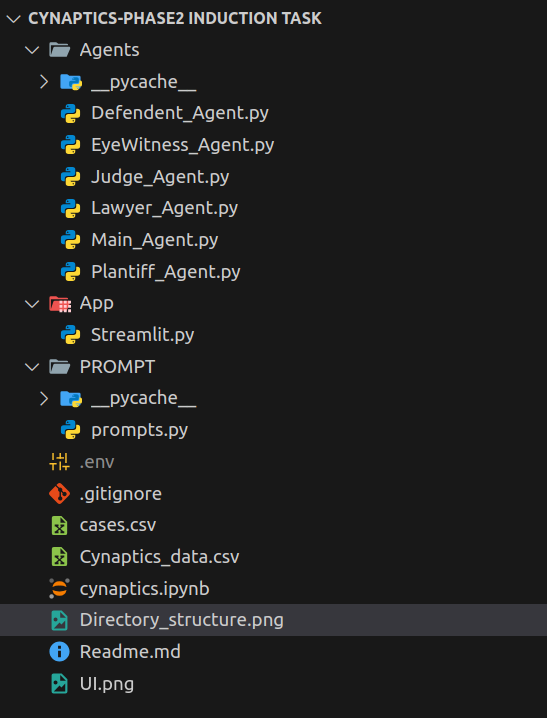
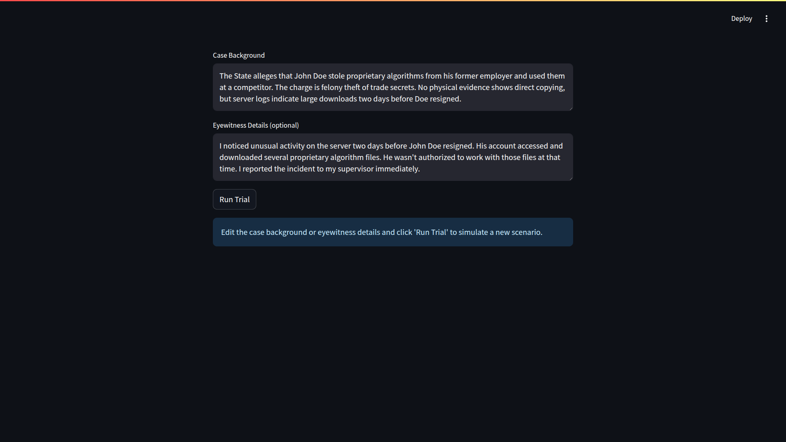

# Cynaptics-phase2 Induction Task: Courtroom Simulation

## Overview

This project simulates a courtroom using multiple AI agents—Prosecution, Defense, Judge, Plaintiff, Defendant, and Eyewitness—each acting according to real case data. The system demonstrates agentic reasoning, legal argumentation, and verdict generation, and can be run via a web interface (Streamlit).

---

## Directory Structure



## Setup Instructions

1. **Clone the Repository**
    ```
    git clone https://github.com/sairaj22019/Cynaptics-induction-Task-Court-Room-.git
    cd Cynaptics-phase2-Induction-task
    ```
2. **Environment Variables**
    - Create a `.env` file in the root directory if not present.
    - Add any necessary API keys or environment variables required for LLM access.
  


## Running the Demo

### Option 1: Jupyter Notebook(Preffered)
Open cynaptics.ipynb notebook file in Jupyter Notebook, JupyterLab, or VS Code.

Run each cell consecutively from top to bottom to execute the simulation and view outputs inline.

### Option 2: Streamlit Web Interface

cd App
streamlit run Streamlit.py

- Open the provided local URL in your browser to interact with the simulation.

## User Interface

